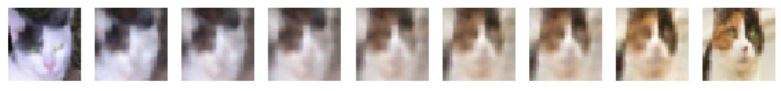
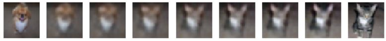
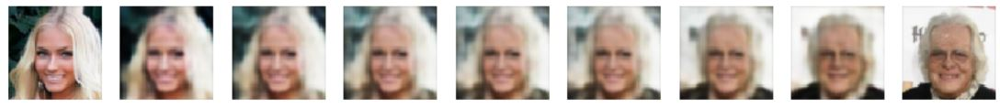
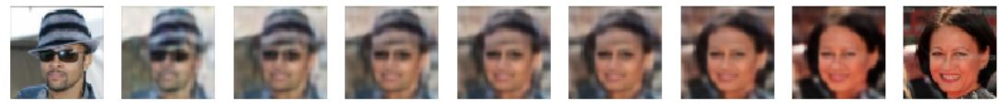
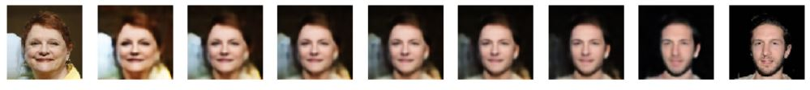
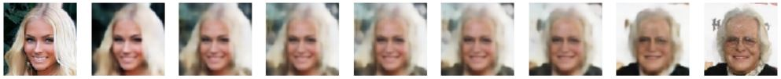

# deep-photo-masher

The main goal of this project is to play around and a little bit with variational autoencoders (VAE) for educational purposes. This a workspace for experimenting with different VAE architectures and datasets.

VAEs can be used for image encoding and for artificial images creation. the main difference between VAEs and GANs, is the fact that with VAEs we can easily extract a latent vector (z) represenatation of an existing image, and play around with it.

The application that I am trying to create here is a VAE photo masher that is doing the following steps:
* Train a VAE on a certain dataset
* Used trained net to extract latent vectors from 2 images
* Create a new arificial image from a linear combination of the 2 z vectors

hopefully, the images created from latent space arithmetics (decoded(w1 * z1 + w2 * z2)) will be more interesting that simple image combinations (w1 * img1 + w2 * img2) :)

This project is still a work in progress.

## CIFAR10 examples (32X32 pixels)

not too pleased with CIFAR10 results. The natural VAE bluriness is really enhanced on the small images. the feature distribution of this dataset is very wide, it was hard for the latent space to converge into meaningful features.
## CelebA examples (64X64 pixels)

## CelebA examples (128X128 pixels)

